# VBCDX data schema

The storage model behind the Keyhole and Dispatch prototypes (`mocks/v1`). Keyhole and Dispatch share organizations, workspaces and players; each app keeps its own content. This folder is the same in both repos except for the product folder: `keyhole/` is only in the Keyhole repo and `dispatch/` is only in the Dispatch repo.

| Path | What | Same in both repos |
|---|---|---|
| `README.md` | This overview | yes |
| `cache.md` | Encrypted local credential cache in the Keyhole vault connector, the Keyhole sidecar and the Dispatch sidecar | yes |
| `cli.md` | `keyhole` and `dispatch` CLIs, installers, config | yes |
| `shared/` | Auth service contract, shared records (orgs, workspaces, workspace memberships, agents, audit envelope), the outbox contract, common `$defs`, and `tools/mongo_validator.py` | yes, byte for byte |
| `keyhole/` | Stores, keys, tools, grants, availability, cabinets, connectors and sidecars, the Redis key-space | Keyhole repo only |
| `dispatch/` | Messages, receipts, threads, tags, filters, webhooks, the Dispatch sidecar, the Redis key-space | Dispatch repo only |

Every `*.schema.json` file is JSON Schema 2020-12. There is one file per collection or entity. Each file's `$id` is `https://schemas.vbcdx.dev/<path>`, and a `$ref` is a relative path, so a schema resolves from a checkout with no network access. Each product's `indexes.json` binds each Mongo collection to its schema (its validator) and lists its indexes. Each `collections.md` explains them.

## 1. Overview

```mermaid
erDiagram
  %% auth service (separate service and database)
  USER ||--o{ IDENTITY : "signs in with"
  USER ||--o{ SESSION : has
  USER ||--o{ MFA_FACTOR : has
  USER ||--o{ ORG_MEMBERSHIP : "role and status per org"
  ORG_MEMBERSHIP }o--o| SUSPENSION : "current suspension"
  USER ||--o{ SUPPORT_LOCK : "account-wide"
  ORG ||--o{ INVITATION : issues

  %% suite database (shared by both apps)
  ORG ||--o{ ORG_MEMBERSHIP : ""
  ORG ||--o{ WORKSPACE : contains
  ORG ||--o{ AGENT : owns
  WORKSPACE ||--o{ WORKSPACE_MEMBERSHIP : ""
  USER ||--o{ WORKSPACE_MEMBERSHIP : "member / workspace_admin"
  AGENT ||--o{ WORKSPACE_MEMBERSHIP : "member"
  ORG ||--o{ AUDIT_EVENT : "shared rows"
  AUDIT_EVENT ||--o| OUTBOX_EVENT : "same transaction"

  %% keyhole database
  ORG ||--o{ KH_STORE : ""
  KH_STORE ||--o{ KH_KEY : ""
  KH_KEY ||--o{ KH_LOCAL_KEY_VALUE : "Local store only"
  ORG ||--o{ KH_TOOL : ""
  WORKSPACE ||--|| KH_WORKSPACE_AVAILABILITY : "available / exposed"
  WORKSPACE ||--o{ KH_GRANT : ""
  KH_GRANT }o--|| KH_TOOL : ""
  WORKSPACE ||--o{ KH_CABINET : ""
  AGENT ||--|| KH_AGENT_PROFILE : "kh_live_ token, status"
  KH_STORE }o--o| KH_CONNECTOR : "routes through (vault)"
  AGENT ||--o{ KH_CONNECTOR : "sidecar acts as"

  %% dispatch database
  WORKSPACE ||--o{ DSP_MESSAGE : ""
  DSP_MESSAGE ||--o{ DSP_RECEIPT : "per targeted agent"
  DSP_MESSAGE ||--o| DSP_WEBHOOK : "fire / listen"
  WORKSPACE_MEMBERSHIP ||--o| DSP_MEMBERSHIP_ACCESS : "read/write, dsp_ws_ token"
  AGENT ||--|| DSP_AGENT_PROFILE : "dsp_agent_ token, filters"
  AGENT ||--o{ DSP_SIDECAR : "bound to"
```



The shared records are orgs, workspaces, workspace memberships and agents, plus the audit envelope. Each app adds its own rows, keyed by the shared ID:

- **Keyhole:** `workspace_settings`, `workspace_availability` and `agent_profiles`.
- **Dispatch:** `workspace_settings`, `membership_access` (keyed by membershipId) and `agent_profiles`.

## 2. Which datastore owns what, and why

| Store | Owns | Why |
|---|---|---|
| **Auth service** (its own service and DB) | users, identities/SSO links, sessions, MFA factors, org memberships and roles, invitations, support locks, suspensions | Humans sign in once for the whole suite, and both apps need the same identity. Credentials and MFA stay out of the app databases, so an app compromise doesn't leak password hashes or TOTP seeds. Agents are not users: agent credentials live in each app. |
| **Mongo `suite`** | orgs, workspaces, workspace_memberships, agents, shared audit_events, outbox, outbox_consumers | These records are shared by both apps, so each one is written once and read by both. They're small and change rarely, and they need transactions with their audit row and outbox row. |
| **Mongo `keyhole`** | stores, keys, local_key_values, tools, tool_versions, grants, workspace availability and settings, cabinets, agent profiles, connectors, enrollment tokens, connection tests, event sources, issuer keys, Keyhole-only audit rows | Configuration and audit, with JSON Schema validators. Local-store values are the only secret values here, and they are envelope-encrypted. |
| **Mongo `dispatch`** | messages (system of record), message blobs, receipts, threads, tags, context notes, workspace settings, membership access, agent profiles, webhooks, listener calls, dead letters, sealed secrets, sidecars, enrollment tokens, Dispatch-only audit rows | History, search (text indexes), large JSON bodies (blobs up to 15 MiB, then GridFS), and configuration. |
| **Redis (Keyhole)** | rate-limit buckets, in-flight requests, component presence, tunnel routing, config version, invalidation pub/sub | Operational, short-lived, and high QPS. Losing it loses no configuration: presence and buckets rebuild within one heartbeat or window. It holds **no secret values**. |
| **Redis (Dispatch)** | per-workspace message streams, per-agent inbox streams and consumer groups, receipt counters, presence, webhook retry ZSETs, pull streams for sidecars, rate limits | Live delivery and scheduling. Mongo is the record of truth: Redis can be rebuilt from `messages`/`receipts`/`webhooks`. |
| **KMS** (AWS KMS, GCP KMS, Azure Key Vault, or Vault/OpenBao Transit) | key-encryption keys; Keyhole's OIDC signing keys | Data keys are wrapped outside the database, so a DB dump alone decrypts nothing. |
| **Keyhole sealed-secret service** (`kss://`) | store credentials Keyhole must hold (AppRole secret_id, API keys, client secrets, private keys) | Keyhole's Mongo holds no secret values except Local-store keys. A dedicated KMS-backed secret backend with its own access policy holds these, and Mongo stores only a `secretRef`. |
| **Component-local cache** | resolved secrets and delivered tokens on customer hosts | Fewer round trips to Keyhole and the vault. See `cache.md`. |

Keyhole and Dispatch should run separate Redis deployments: the load profiles differ, and so does the blast radius. The Mongo databases can share one replica set or cluster, which lets a transaction span `suite` and an app database (see §6).

## 3. Conventions

- **Field names** are camelCase.
- **`_id`** holds the prefixed public ID (`org_acme`). APIs expose it as `id`.
- **Timestamps:** `createdAt`, `updatedAt` and every other instant are ISO-8601 in the schemas and BSON Date in Mongo.
- **`createdBy` / `updatedBy`** are principal refs `{kind: user|agent|support|system, id}`. They grant nothing (rule 3).
- **`rev`** is an optimistic-concurrency counter on every mutable shared or config row. Outbox events carry it.
- **`deleteAt`, `expireAt` and `destroyAt`** are TTL fields (`expireAfterSeconds: 0`). Retention is data, not code.
- **Soft deletion** applies only where history must resolve a name: orgs and workspaces (`status: deleted`), and stores (`status: removed`). Other records are deleted outright, and the audit log keeps the history.
- **`x-verify: true`** (with `x-verify-note`) marks every field or method whose fact is ⚠/◐ (unverified) in VAULT_FLOWS.md. Check these before you ship UI copy or validation that depends on them.
- **Store auth methods** carry these annotations:
  - `x-route` (`either` | `connector_only`);
  - `x-stores-secret`;
  - `x-recommended` / `x-discouraged`.

### ID prefixes

IDs are `<prefix>_` followed by 1–41 characters from `[A-Za-z0-9_]`. The seed IDs (`ws_prod`, `ag_billing`, `ev_1`) fit. Generated IDs use 16 base62 characters. Outbox IDs use a ULID, so `_id` order is commit order.

| Prefix | Record | $defs name |
|---|---|---|
| `org_` | Organization | `orgId` |
| `ws_` | Workspace | `workspaceId` |
| `u_` | User (human) | `userId` |
| `ag_` | Agent (shared identity record) | `agentId` |
| `wm_` | Workspace membership (human or agent) | `workspaceMembershipId` |
| `om_` | Org membership | `orgMembershipId` |
| `inv_` | Invitation | `invitationId` |
| `idn_` | Linked identity / SSO link | `identityId` |
| `ses_` | Session | `sessionId` |
| `mfa_` | MFA factor | `mfaFactorId` |
| `lock_` | Support lock | `supportLockId` |
| `susp_` | Suspension | `suspensionId` |
| `sup_` | Keyhole support operator (superAdmin; outside every org) | `supportAgentId` |
| `ev_` | Audit event | `auditEventId` |
| `obx_` | Outbox event | `outboxEventId` |
| `trk_` | Tracking code (8 lowercase alphanumerics) | `trackingCode` |
| `enr_` | Enrollment token record | `enrollmentTokenId` |
| `st_` | Keyhole secret store | `storeId` |
| `k_` | Keyhole key | `keyId` |
| `lkv_` | Keyhole Local-store key value | `localKeyValueId` |
| `t_` / `a_` / `i_` / `s_` | Keyhole tool / action / input / key slot | `toolId`, `toolActionId`, `toolInputId`, `keySlotId` |
| `gr_` | Keyhole workspace tool grant | `grantId` |
| `cb_` | Keyhole cabinet | `cabinetId` |
| `cn_` | Keyhole vault connector | `vaultConnectorId` |
| `sc_` | Keyhole sidecar | `keyholeSidecarId` |
| `ctest_` | Keyhole store connection test | `connectionTestId` |
| `esrc_` | Keyhole store change-event source | `storeEventSourceId` |
| `ikey_` | Keyhole OIDC issuer signing key | `issuerKeyId` |
| `msg_` | Dispatch message | `messageId` |
| `wh_` / `wa_` | Dispatch webhook / webhook attempt | `webhookId`, `webhookAttemptId` |
| `lsn_` | Dispatch listener (public URL ID) | `listenerId` |
| `lc_` | Dispatch listener call | `listenerCallId` |
| `dlq_` | Dispatch webhook dead letter | `deadLetterId` |
| `nt_` | Dispatch context note | `noteId` |
| `sec_` | Dispatch sealed secret | `sealedSecretId` |
| `blob_` | Dispatch large body/payload | `blobId` |
| `dsc_` | Dispatch sidecar | `dispatchSidecarId` |

### Token prefixes (plaintext shown once, never stored)

| Token prefix | What | Stored as (digest only) |
|---|---|---|
| `kh_live_…` | Keyhole agent token | `keyhole.agent_profiles.token` |
| `kh_conn_…` | Keyhole vault connector credential | `keyhole.connectors.credential` (kind vault) |
| `kh_sc_…` | Keyhole sidecar credential | `keyhole.connectors.credential` (kind sidecar) |
| `kh_call_…` | Keyhole sidecar local caller token | `keyhole.connectors.local.localAuth.callerToken` |
| `kh_enr_…` | Keyhole enrollment token (single use, 15 min) | `keyhole.enrollment_tokens.token` |
| `dsp_agent_…` | Dispatch agent token | `dispatch.agent_profiles.token` |
| `dsp_ws_…` | Dispatch per-membership workspace token | `dispatch.membership_access.token` |
| `dsp_hook_…` | Dispatch listener basic-auth password | `dispatch.webhooks.listen.password` |
| `dsp_sc_…` | Dispatch sidecar credential | `dispatch.sidecars.credential` |
| `dsp_call_…` | Dispatch sidecar local caller token | `dispatch.sidecars.local.localAuth.callerToken` |
| `dsp_enr_…` | Dispatch enrollment token (single use, 15 min) | `dispatch.enrollment_tokens.token` |
| `au_rt_…` | Auth service refresh token | `auth.sessions.refresh.current` |
| `au_inv_…` | Auth service invitation link token | `auth.invitations.token` |

## 4. Tenancy: every document carries `orgId`, and every index starts with it

- **orgId on every row.** Every tenant document has `orgId`, including rows whose `_id` is another record's ID (`workspace_settings`, `agent_profiles`, `membership_access`). The exceptions are platform rows (`issuer_keys`) and the auth service's user-level rows (users, identities, sessions, MFA factors), which belong to a person rather than an org.
- **Index-first.** Every compound index begins with `orgId`. The only exceptions are the **auth-path** indexes marked `"global": true` in `indexes.json`. These look up a credential digest (`token.current.hash`), a listener ID or a slug before the org is known. The handler then reads `orgId` from the row and scopes everything after that to it.
- **Queries go through a repository layer that injects `{orgId}`.** A query without it is a bug; CI greps for raw collection access. Cross-org queries exist only in support tooling, and support tooling reads auth-service data, never content.
- **Encryption binds the tenant.** Envelope-encryption AAD and cache AAD include `orgId`, so a ciphertext can't be replayed into another tenant.
- **Redis keys carry the tenant.** They include `{orgId}` or `{wsId}` as a cluster hash tag (see each `redis.md`), so related keys live on one slot and Lua scripts stay single-slot.

## 5. How the two products share records

1. **Written once.** Orgs, workspaces, workspace memberships and agents are written once, to `suite`, by whichever app the admin used. Both apps read the same rows. Neither app keeps a copy.
2. **One role model.** Org roles and status come from the auth service (`org_memberships`, reflected in the access token's claims). Workspace roles come from `suite.workspace_memberships`: `member` or `workspace_admin`, for humans. Default admins (rule 2) are derived: when a workspace has no explicit human admin, its admins are the org's active Owners and userAdmins. They are never stored.
3. **App extensions** hang off the shared ID:

   | Shared record | Keyhole extension | Dispatch extension |
   |---|---|---|
   | workspace (`ws_…`) | `workspace_settings` (slug, HTTPS/MCP), `workspace_availability` (available keys/tools, exposed keys) | `workspace_settings` (description, default expiry, retention, agent blocklist) |
   | workspace membership (`wm_…`) | none today | `membership_access` (read/write, `dsp_ws_` token, agent workspace admin) |
   | agent (`ag_…`) | `agent_profiles` (status, `kh_live_` token, expiry, rate limit) | `agent_profiles` (status, `dsp_agent_` token, filters, reported client) |
   | org (`org_…`) | `org_settings` (notifications, configVersion) | `org_settings` (notifications) |

4. **Agent status is per app.** This keeps the prototypes' behaviour: an agent can be suspended in Dispatch and active in Keyhole. `suite.agents.retiredAt` retires it everywhere.
5. **Agent workspace admin is Dispatch-only.** The shared row for an agent is always `member` (the schema enforces this). Dispatch keeps agent admin in `membership_access.agentRole`, and Keyhole never sees it. An agent admin never replaces the human admin.
6. **Audit is split.** A shared fact is one row in `suite.audit_events` with `shared: true`, and both apps show it, marked Shared. Its consequences inside one app are separate app-only rows in `<app>.audit_events`, whose `causationId` points at the shared row. The schema forbids `detail` and `link` on shared rows, which fixes the PR #20 review finding that Keyhole-only detail was leaking into Dispatch. `app` records where the action happened and replaces Keyhole's `source: 'Dispatch'`.
7. **Support actions are shared.** Support lock, unlock, sign-out-everywhere and resend-invite act on the account, which spans both apps, so they are `type: support`, `shared: true`, `app: auth`. The Keyhole README must say the same (review finding).
8. **Public API vocabulary.** Dispatch's public API says `human` and `webhook` where this schema says `user` and `listener`. The API layer maps them; the data uses one vocabulary suite-wide.

## 6. Consistency and outbox rules for shared events

The full contract is in `shared/outbox.md`. In short:

1. **One transaction.** A shared change writes, in one majority-acknowledged transaction in `suite`:
   - the record, guarded by `rev`;
   - its shared audit row;
   - one `suite.outbox` row.

   When the app database is on the same cluster (the default), the app's own extension rows join the same transaction, for example `membership_access` for a new agent membership.
2. **Relay.** The relay tails a change stream on `suite.outbox`, publishes to Redis (`kh:inv:{orgId}` and `dsp:inv:{orgId}`), and sets `publishedAt`. Consumers checkpoint resume tokens in `suite.outbox_consumers`.
3. **Idempotent projectors.** Each app's projector records every event it applies in `<app>.applied_events`, inserted if absent and in the same transaction as its writes. It drops events whose `aggregate.rev` is not newer than what it has.
4. **Refusals are fast-pathed** (rule 5). Suspend, remove, retire, lock and sign-out-everywhere set `refusal: true`, and the writer also publishes them straight to Redis after commit. Apps also re-check at action time: the permission check reads `suite` (or a cache invalidated by these events). So a refusal applies to the next call or the next queued delivery, never to history.
5. **No app-specific consequences in shared payloads.** Each app derives its own consequences from the shared event: Keyhole refuses the sidecars acting as a removed agent; Dispatch filters queued receipts. Each app logs those consequences in its own audit rows.
6. **Auth-service changes enter through the same door.** The auth service keeps its own outbox. Its relay posts to the suite ingest endpoint, which writes the shared audit row and the `suite.outbox` row in one transaction, idempotent on the auth event ID. Consumers see one stream.

## 7. PII and secret handling

**Secrets**
- **No secret values in Keyhole's Mongo, except Local-store keys.** Those are in `keyhole.local_key_values`, envelope-encrypted (AES-256-GCM data key, wrapped by a KMS key named in `dek.kmsKeyRef`). AAD is `orgId|keyId|version`.
- **Store credentials are only `secretRef`s**, pointing at one of two places:
  - `sealed`: the Keyhole sealed-secret service, `kss://…`, with a KMS ref;
  - `connector_local`: entered on the connector host with `keyhole connector secret set`, and never sent to the SaaS.

  Federated methods (Keyhole as OIDC issuer) store nothing.
- **Dispatch's only presentable secrets** are outbound webhook basic-auth passwords. They are in `dispatch.sealed_secrets` (envelope-encrypted, `dss://sec_…`) and are destroyed a week after the message expires.
- **Tokens are stored only as `tokenDigest`:** prefix, last four, and a hash.
  - `sha256` means HMAC-SHA256 with a versioned server pepper, for generated high-entropy tokens that are looked up on every request.
  - `argon2id` (PHC string) is for anything short or human-chosen: passwords in the auth service, MFA recovery codes.

  The plaintext is shown once (the "brass panel") and then discarded.
- **Rotation is a `credentialSet`: at most one previous credential.**
  - The admin picks the grace period at rotate time (0 to 24 h).
  - A second rotation during grace ends the earlier grace immediately, and the audit row says so.
  - "End grace now" clears `previous`.
- **Enrollment tokens** (`kh_enr_`, `dsp_enr_`) are single use, expire after 15 minutes, and are consumed atomically. The CLIs refuse them on argv (`cli.md`).
- **Redis never holds a secret value, token or data key.** Keyhole resolves secrets in broker process memory only (mlocked, zeroed on eviction). There is no Keyhole-side Redis secret cache.
- **Logs, audit rows and connection tests record IDs and versions only**, never values or request and response bodies.

**PII**
- **Where it lives:**
  - users' names and emails, sessions' IP, device and place, and identities' email-at-link, all in the auth service;
  - `actor.label` snapshots in audit rows;
  - listener caller IPs in `dispatch.listener_calls` and `messages.author.from`;
  - message bodies and context notes, which are customer content.
- **Retention:**
  - IPs are truncated after 90 days;
  - listener calls expire after 90 days;
  - audit rows expire per `org.auditRetentionDays`;
  - messages expire per workspace `retentionDays`.
- **Erasure:** the auth service replaces the name and email, deletes identities and sessions, and emits an event. A suite job then pseudonymises `actor.label` on that user's audit rows, and the `u_` ID stays so history still resolves (rule 4). Message bodies a person wrote belong to the workspace, and are removed by retention or workspace deletion, not by user erasure.
- **Support (superAdmin)** reads only auth-service data: lock, unlock, sign-out-everywhere, resend-invite. It has no read path to app databases.

## 8. Validating

```sh
# every file parses
find mocks/schema -name '*.json' -exec python3 -m json.tool {} \; >/dev/null
# MongoDB validators + indexes (mongosh script)
python3 mocks/schema/shared/tools/mongo_validator.py --indexes mocks/schema/keyhole/indexes.json   # or dispatch/, shared/
```

The schemas were checked against the 2020-12 metaschema with every `$ref` resolved. Their embedded `examples` (taken from the prototypes' seed data) validate, and a set of targeted negative cases is rejected, for example:
- a Kubernetes auth method routed direct;
- a sidecar on 0.0.0.0 without the network flag;
- a shared audit row with app detail;
- an agent with shared workspace_admin;
- a plaintext webhook password.

The converted Mongo validators were checked to preserve those results.
