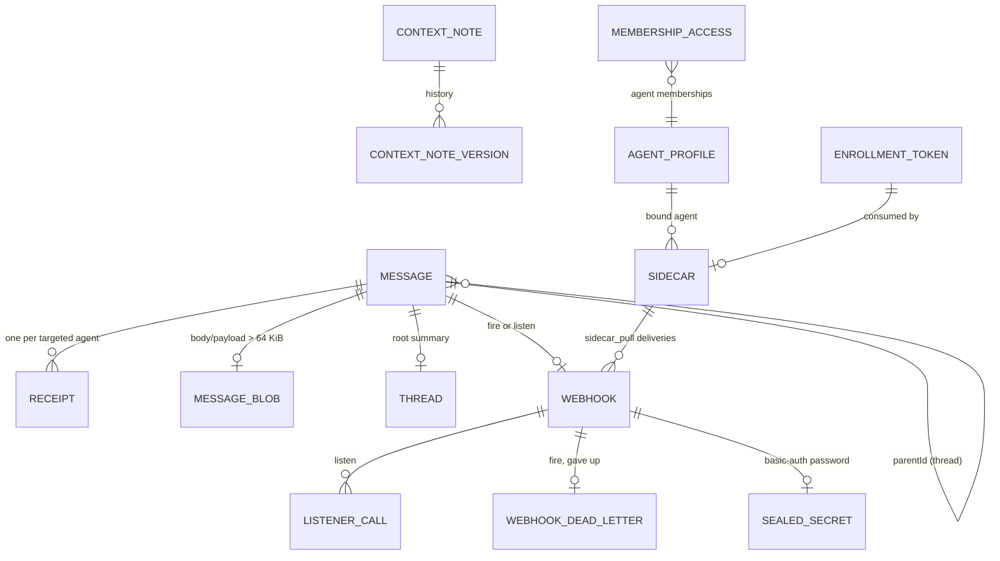

# Dispatch collections (Mongo database `dispatch`)

Validators and indexes are in `indexes.json`. To generate the mongosh script:

```sh
python3 ../shared/tools/mongo_validator.py --indexes indexes.json
```



| Collection | Schema | Holds | Notes |
|---|---|---|---|
| `messages` | `message.schema.json` | The system of record for messages: body (inline ≤ 64 KiB, else a blob with a preview), payload, tags, audience, thread links, expiry, tracking code, receipt-count snapshot | Written **before** the Redis stream entry (§ send flow). A compound text index `(orgId, workspaceId, body text, tags)` serves search, with a tenancy prefix. TTL `deleteAt` = workspace retention. |
| `message_blobs` | `message_blob.schema.json` | Large bodies and payloads, gzip; > 15 MiB compressed goes to GridFS `message_blobs_fs` | Deleted with the message. |
| `receipts` | `receipt.schema.json` | One per (message, targeted agent): queued, held, delivered, read, acked, filtered, never_delivered | Delivered, read and acked are never relabelled. A final refusal filters only undelivered receipts, and never counts as completion. |
| `threads` | `thread.schema.json` | Root-message summary: replies, last reply, participants | Maintained on reply. |
| `tags` | `tag.schema.json` | Per-workspace tag index | Tags only filter; every member sees every tag. |
| `context_notes`, `context_note_versions` | `context_note…` | Versioned shared context | Every write bumps the version and appends history. |
| `workspace_settings` | `workspace_settings.schema.json` | Description, default expiry, retention, **workspace agent blocklist** | Extends `suite.workspaces`. |
| `membership_access` | `membership_access.schema.json` | Per membership: read/write, agent workspace admin, `dsp_ws_` token, token delivery (shown once or sealed to the sidecar) | Extends `suite.workspace_memberships`. read off ⇒ write off; humans always read. |
| `agent_profiles` | `agent_profile.schema.json` | Status, `dsp_agent_` token, **own filters** (read, write, workspace blocklist, agent blocklist), reported client | Extends `suite.agents`. |
| `webhooks` | `webhook.schema.json` | A message's fire hook (URL, trigger, basic-auth secretRef, delivery push or `sidecar_pull`, state, attempt snapshot) or its listener (`lsn_` ID, user, password digest) | Retry schedule 30 s / 2 min / 10 min in Redis; nothing fires after expiry. |
| `listener_calls` | `listener_call.schema.json` | Every call to a listener URL (202, 401, 410, 413, 429), with caller IP | TTL 90 days. |
| `webhook_dead_letters` | `webhook_dead_letter.schema.json` | Fire hooks that gave up, with all attempts | Replayable until the message expires. TTL 30 days. |
| `sealed_secrets` | `sealed_secret.schema.json` | Outbound basic-auth passwords, envelope-encrypted | `dss://sec_…`. Destroyed 7 days after the webhook expires. |
| `sidecars` | `sidecar.schema.json` | Dispatch sidecars: bound agent, `dsp_sc_` credential, local endpoint, held-token metadata, pull cursors, cache policy | |
| `enrollment_tokens` | `enrollment_token.schema.json` | `dsp_enr_` records | Single use, 15 minutes. |
| `org_settings` | `org_settings.schema.json` | Notifications, default rotation grace | |
| `audit_events` | `../shared/audit_event.schema.json` + `audit_detail.schema.json` | Dispatch-only rows | Never message bodies or passwords. |
| `applied_events` | `../shared/applied_event.schema.json` | Projector idempotency | TTL 14 days. |

## Access ladder (filters and blocklists)

Every agent request walks these checks in order. The first failure decides, and a refusal always beats a grant.

1. The agent ID and `dsp_agent_` token match a row in `agent_profiles.token` (current, or previous while in grace), and `status: active`.
2. The agent's own `filters.workspaceBlocklist` doesn't list the workspace.
3. The workspace's `workspace_settings.agentBlocklist` doesn't list the agent.
4. The workspace ID and `dsp_ws_` token match `membership_access.token`, and `tokenRevokedAt` is null.
5. The membership allows the operation: `read` / `write` / admin (`agentRole: workspace_admin`).
6. The agent's own `filters.read` / `filters.write` allow it.
7. Per message: the recipient's `filters.agentBlocklist` doesn't list the author.

At delivery, the ladder is re-run for each queued receipt:
- a **final** refusal (block, removal, revocation, token revoked) sets `state: filtered` with `afterSend: true`;
- a **reversible** refusal (suspended, membership read off, the agent's own read off) sets `state: held`, and the receipt joins `dsp:{ag}:held`.

## Send flow

1. The API authenticates the author (ladder with `write`), validates the audience against `suite.workspace_memberships`, and generates `msg_…` and `trk_…`.
2. **Mongo, one transaction:**
   - insert the `messages` row and one `receipts` row per target (status from the ladder: `queued`, `held`, or `filtered` with `afterSend: false`);
   - insert the `webhooks` row (and its `sealed_secrets` row for a fire hook's basic-auth password);
   - insert the `threads` upsert and the `tags` upserts;
   - insert an app-only audit row.
3. **Redis:**
   - `XADD dsp:{ws}:msgs` (the live view);
   - for each deliverable target, `XADD dsp:{ag}:inbox`;
   - `HSET dsp:rc:{msg}`;
   - `ZADD dsp:expiry`;
   - for a `send`-trigger fire hook, `ZADD dsp:wh:due now`.

   If the Redis step fails after the commit, the `fanout-repair` job finds messages whose `streamEntryId` is unset and replays step 3. Mongo is the truth.
4. **Delivery.** An agent's connection reads its inbox with `XREADGROUP` (group `deliver`). Access is re-checked; the receipt becomes `delivered`, with `XACK`. Read and ack go through the API and update `receipts` and `dsp:rc`. When the counters satisfy a fire hook's `all-read` or `all-ack` trigger, the hook is scheduled.

## Webhooks

- **Fire, push.** A worker claims the hook from `dsp:wh:due` (`ZRANGEBYSCORE` ≤ now, then `SET dsp:wh:lock:{wh} NX`), unseals the password, and POSTs to the URL with a 10 s timeout. It records the attempt in `dsp:wh:attempts:{wh}` and snapshots it into `webhooks.fire.attempts`.
  - On failure it schedules the next attempt at +30 s, +2 min, then +10 min.
  - After attempt 4 fails: `state: gave_up`, plus a `webhook_dead_letters` row.
  - At message expiry: `state: expired`, and nothing more fires.
  - If a target can no longer meet the trigger: `state: target_lost`, with `dropped`.
- **Fire, sidecar pull.** Instead of POSTing, the worker `XADD`s the delivery to `dsp:{dsc}:pull`, with the basic-auth password sealed to that sidecar's public key. The sidecar (inside the customer's network) reads with `XREADGROUP`, POSTs locally (only to `pull.webhooks.allowedTargets`), and reports the result with `POST /v1/sidecars/{id}/deliveries/{entry}`. That report is recorded as the attempt, and the same retry schedule applies.
  - If the sidecar is offline past the next due time, the attempt counts as failed (`note: sidecar offline`).
  - After the last attempt, the dead letter's `reason` is `sidecar_unavailable`.
- **Listen.** `POST https://hooks.dispatch.dev/l/{lsn}`:
  - the hot path reads `dsp:lsn:{lsn}` (falling back to Mongo), checks the basic-auth password against the `dsp_hook_` digest, and checks expiry;
  - 202 appends a message with `author {kind: listener, id: lsn_…, from: ip}`;
  - 401 for a wrong password, 410 after expiry, 429 over the per-listener limit;
  - every call writes a `listener_calls` row.
